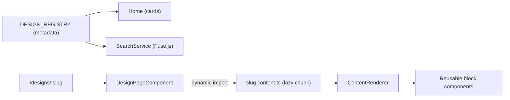

# Architecture

This document explains how the platform is structured and why.

## Monorepo layout

```
system-design/
├── frontend/        # Angular 21 app (the platform itself)
├── backend/         # Optional Spring Boot (Java 17) metadata + search API
├── docs/            # Authoring & deployment guides
├── scripts/         # new-design.mjs scaffolder
└── docker-compose.yml
```

> Note: the app lives in `frontend/` (not a repo-root `src/`) so the optional
> backend can coexist cleanly in the same repository.

## Frontend: data-driven content engine

The central idea is that **a System Design is data, not code**. Authors write a
typed content object; a generic renderer turns it into reusable components.



### Key pieces

- **Content schema** — `shared/models/content-block.model.ts` defines a
  discriminated union of every content block. `design.model.ts` defines
  `DesignMeta`, `DesignSection`, and `DesignContent`.
- **Registry** — `core/config/design-registry.ts` is the single source of truth.
  Each entry holds lightweight `meta` (statically imported) and a `load()` that
  **lazily imports** the full content chunk. Adding a design = one entry.
- **Renderer** — `shared/components/content-renderer` maps each block `type` to a
  component via `@switch`, wrapping heavy ones (Mermaid, KaTeX, media) in
  `@defer (on viewport)` so they load only when scrolled into view.
- **Routing** — a single lazy route `/designs/:slug` renders any design.
  Hundreds of designs add only small content chunks, never route-table bloat.

### Folder structure (inside `frontend/src/app`)

```
core/        # Singletons: services, guards, interceptors, layout, config
shared/      # Reusable components, directives, pipes, models, utils, styles
features/    # Home, design-page, not-found, and system-designs/<slug>/
```

- **`core/`** — `ThemeService`, `DesignRegistryService`, `SearchService`,
  `TocService`, `SeoService`, `ContentSource` abstraction, guards, interceptors,
  and the app-shell layout (header / sidebar / TOC / footer).
- **`shared/`** — every reusable component (CodeBlock, Callout, Mermaid viewer,
  HeroBanner, TOC, etc.), the `ContentRenderer`, pipes, and directives.
- **`features/system-designs/<slug>/`** — `*.meta.ts` + `*.content.ts` per design.

### State & performance

- **Signals** everywhere for state; **OnPush** change detection on all components
  (the app runs **zoneless**).
- **Lazy loading**: routes and per-design content via dynamic `import()`.
- **`@defer`** for Mermaid, KaTeX, and media.
- **Theming** via CSS custom properties flipped by a `data-theme` attribute.

### The `ContentSource` seam

`core/services/content-source.ts` defines an abstract `ContentSource`. The
default `StaticContentSource` reads from the bundled registry. To use the
backend, provide an `ApiContentSource` and set `apiBaseUrl` — **no UI changes**.

## Backend (optional)

A Spring Boot service exposing `/api/designs`, `/api/designs/{slug}`, and
`/api/search`. Uses H2 in dev and PostgreSQL in prod (Spring profiles), with
Actuator health endpoints and a permissive security config ready to be locked
down for future authenticated features.

## Future-proofing

The architecture supports the roadmap (auth, bookmarks, comments, progress
tracking, quizzes, i18n, PWA, AI explanations) without restructuring:

- The `ContentSource` abstraction allows a backend swap.
- HTTP interceptors and Spring Security are wired but inert.
- Signals + standalone components make feature isolation easy.
