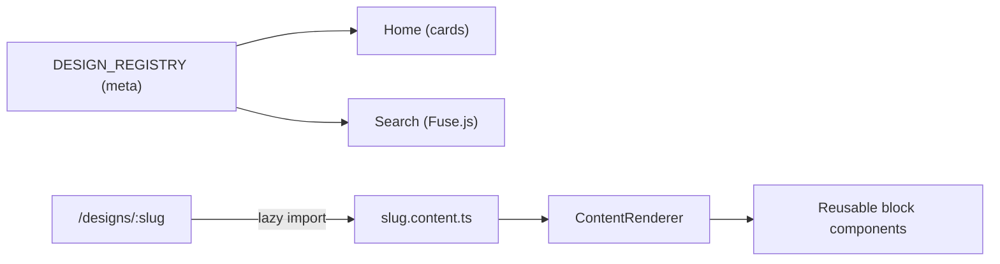

# SystemDesign.dev — Open-Source System Design Learning Platform

A polished, contributor-friendly platform for learning how real-world systems
(Netflix, WhatsApp, Uber, …) are designed to scale. Think of it as an
open-source mix of **ByteByteGo + System Design Primer + a beautiful docs site**.

- ✅ **Angular 21** (standalone, signals, zoneless, OnPush, lazy-loaded)
- ✅ **Data-driven content** — add a design with one command, no boilerplate
- ✅ Rich blocks: Mermaid diagrams, syntax-highlighted code, KaTeX math,
  callouts, API tables, pros/cons, timelines, YouTube embeds, and more
- ✅ Global fuzzy search, dark/light themes, auto table-of-contents
- ✅ Optional **Spring Boot (Java 17)** API + **Docker** + **CI/CD**
- ✅ Works **100% standalone** — the backend is entirely optional

> ⚙️ This repo targets **Angular 21** and **Java 17** (matching common local
> toolchains). See [Known deviations](#known-deviations).

## Quick start

```bash
cd frontend
npm install
npm start
# open http://localhost:4200
```

That's it — the full app runs without any backend.

## Add a new design in 60 seconds

```bash
cd frontend
npm run new:design -- google-drive "Design Google Drive"
```

This scaffolds the module **and registers it automatically**. Edit the generated
`*.content.ts`, then set `status: 'published'`. See [CONTRIBUTING.md](CONTRIBUTING.md).

## Project structure

```
system-design/
├── frontend/                  # Angular app (the platform)
│   └── src/app/
│       ├── core/              # services, guards, interceptors, layout, config
│       ├── shared/            # reusable components, directives, pipes, models
│       └── features/
│           ├── home/
│           ├── design-page/
│           └── system-designs/<slug>/   # *.meta.ts + *.content.ts per design
├── backend/                   # Optional Spring Boot (Java 17) API
├── docs/                      # Authoring & deployment guides
├── scripts/new-design.mjs     # Scaffolder
└── docker-compose.yml
```

See [ARCHITECTURE.md](ARCHITECTURE.md) for the full design.

## How it works (the core idea)

A System Design is **data**, not code. Authors write a typed `DesignContent`
object — an ordered list of sections, each an array of typed content blocks. A
generic `ContentRenderer` maps each block to a reusable component, deferring
heavy ones (Mermaid, KaTeX) until they scroll into view.



## Authoring guides

| Guide | What it covers |
| ----- | -------------- |
| [Adding a design](docs/adding-a-design.md) | Full walkthrough |
| [Code blocks](docs/code-blocks.md) | Syntax highlighting, line highlights, filenames |
| [Mermaid diagrams](docs/mermaid.md) | Flowcharts, sequence, ER diagrams |
| [Images](docs/images.md) | Figures, SVG architecture diagrams, lightbox |
| [Videos](docs/videos.md) | Self-hosted video and iframes |
| [YouTube](docs/youtube.md) | Privacy-friendly embeds |
| [Deployment](docs/deployment.md) | Docker, static hosting, backend |

## Commands (run inside `frontend/`)

```bash
npm start            # dev server
npm run build        # production build
npm test             # unit tests (Vitest)
npm run lint         # ESLint
npm run format       # Prettier (write)
npm run format:check # Prettier (check)
npm run new:design   # scaffold a new design
```

## Optional backend

```bash
cd backend
mvn spring-boot:run          # H2 in-memory, seeded, on :8080
# GET http://localhost:8080/api/designs
```

Switch the frontend to use it by providing an `ApiContentSource` and setting
`apiBaseUrl` in `core/config/app-config.ts` — no UI changes needed.

## Run the full stack with Docker

```bash
docker compose up --build
# frontend → http://localhost:8081   backend → http://localhost:8080
```

## Tech stack

| Layer | Technology |
| ----- | ---------- |
| Frontend | Angular 21, TypeScript (strict), SCSS, Angular Material (selective) |
| Content | marked + DOMPurify, highlight.js, mermaid, KaTeX, Fuse.js |
| Backend | Spring Boot 3 (Java 17), JPA, H2 (dev) / PostgreSQL (prod) |
| Tooling | ESLint, Prettier, Vitest, Playwright (scaffold), GitHub Actions, Docker |

## Roadmap

Authentication · bookmarks · comments · progress tracking · quizzes · i18n ·
PWA · AI-assisted explanations · admin/CMS. The architecture is built to absorb
these without restructuring (see ARCHITECTURE.md).

## Known deviations

- App lives in `frontend/` (not repo-root `src/`) so the backend can coexist.
- Targets **Angular 21** and **Java 17** (latest tooling that runs on common
  local environments); both are trivial to bump.

## License

[MIT](LICENSE). Content is community-contributed.
